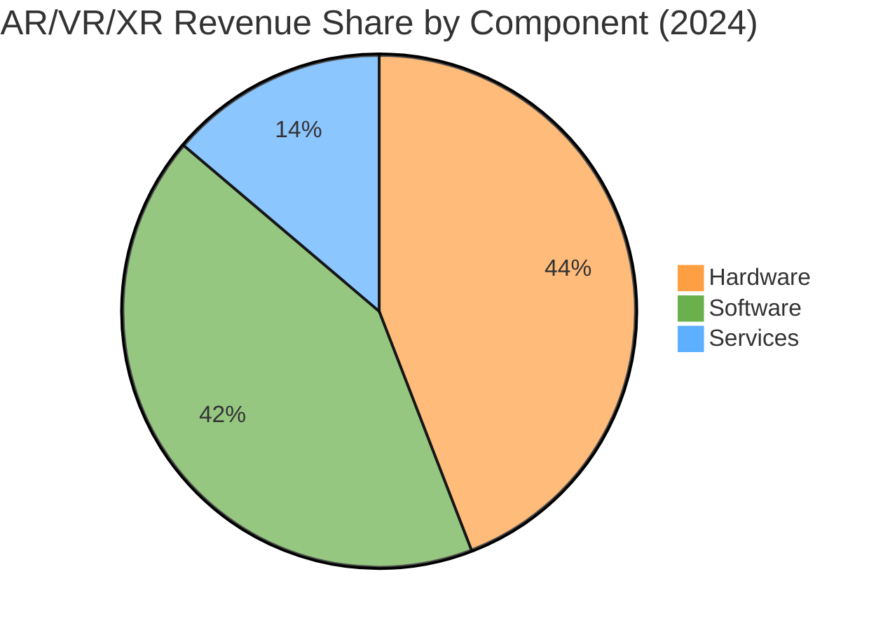
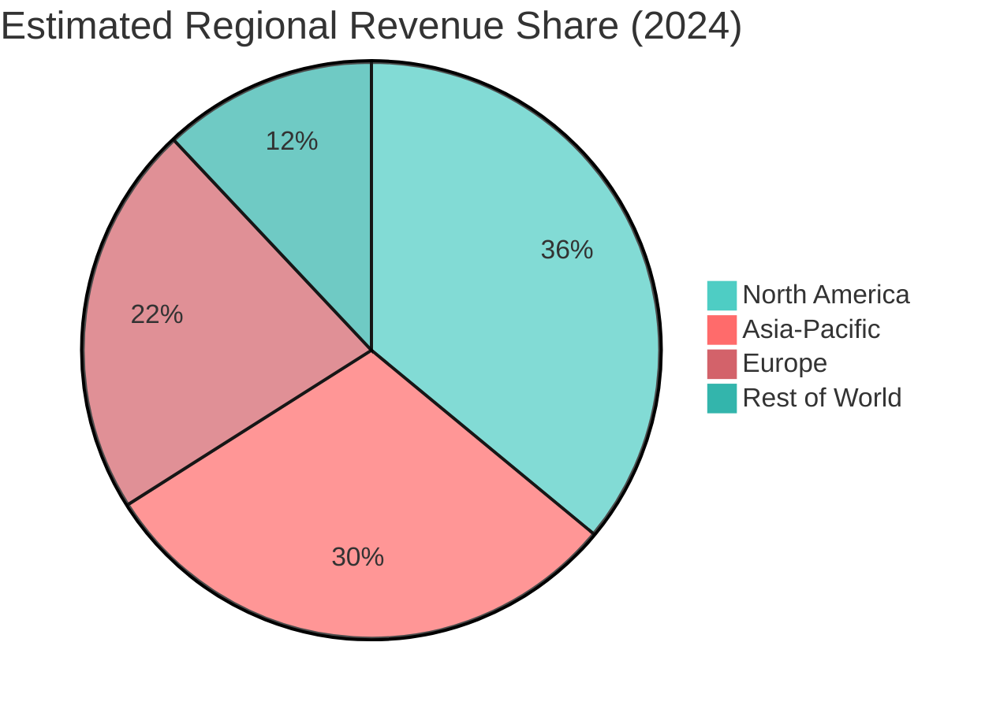

# AR/VR/XR Market – 2024 Detailed Snapshot

## Market Size & Value

| Metric | Value (USD) | Notes | Source |
|--------|-------------|-------|--------|
| **AR + VR Market Revenue** | **59,755.4 Million** (~$59.8 B) | AR and VR combined market revenue for 2024 | [PS Market Research 2024](#source-5) |
| **Global XR Market (AR+VR+MR)** | **> $100 B** | XR market surpassed $100 B in 2022 and continued growth; 2024 estimate based on trend | [Statista 2022‑2026](#source-10) |
| **Alternative Estimate** | **$62.9 B** | XR market size for 2024 (Scoop Market US) | [Scoop Market US 2025](#source-7) |
| **AR‑Only Market** | **$59.8 B** (approx.) | Some sources treat AR+VR as AR‑centric; see variance | [PS Market Research 2024](#source-5) |

*Note: Discrepancies arise from differing definitions (AR/VR only vs. XR inclusive) and reporting bases.*

## Revenue Breakdown by Component (2024)

| Component | Approx. Share | Notes | Source |
|-----------|---------------|-------|--------|
| **Hardware** | **~64%** | Larger share due to head‑mounted displays (HMDs), sensors, and AR glasses shipments | [PS Market Research 2024](#source-5) |
| **Software** | **~61%** | Largest share in some analyses; includes platforms, development tools, enterprise application software | [Precedence Research 2024](#source-9), [MarketsandMarkets](#source-2) |
| **Content** | — | Often bundled with software; explicit splits scarce; considered part of software/services | — |
| **Services** | — | Includes consulting, integration, support, and content creation; growing faster than hardware | — |

*Because reports vary, hardware and software shares are sometimes inverted. Consensus: hardware and software together represent the bulk of the market, with services expanding rapidly.*

## Regional Split (2024 Estimates)

| Region | Revenue Share | Approx. Value (USD) | Notes | Source |
|--------|---------------|---------------------|-------|--------|
| **North America** | **~36%** | ~$21.5 B (based on $59.8 B total) | Largest revenue share; strong enterprise and consumer adoption | [Precedence Research AR 2024](#source-9) |
| **Asia‑Pacific** | — | ~$28.46 B (XR estimate) | Fastest‑growing region; CAGR 35.1% projected through 2030 | [Treeview Studio](#source-3) |
| **Europe** | — | — | Steady growth driven by industrial, healthcare, and training use cases | — |
| **Rest of World** | — | — | Emerging markets; modest but rising adoption | — |

*Note: Exact regional splits are inconsistently reported; Asia‑Pacific figure derives from Treeview’s XR market estimate, while North America share comes from an AR‑focused study.*

## Year‑over‑Year Growth (2023 → 2024)

| Year | Market Size (USD B) | YoY Growth | Notes |
|------|--------------------|------------|-------|
| 2023 | ~50 B (approx.) | — | Derived from backward‑applying ~20% CAGR |
| 2024 | **59.8 B** | ~20% | Based on PS Market Research and Scoop estimates |

## Key Observations for 2024

- **Hardware‑driven early growth**: Strong sales of VR headsets (Meta Quest, PSVR2) and emerging AR glasses (Microsoft HoloLens 2, Magic Leap 2) pushed hardware share.
- **Software & services acceleration**: Enterprise AR/VR platforms (Unity, Unreal Engine, Microsoft Mesh, Apple VisionOS SDK) and services (training, remote assistance) began to outpace pure hardware growth in certain verticals.
- **Regional dynamics**: Asia‑Pacific, led by China and Japan, showed the highest growth rates due to manufacturing adoption and consumer enthusiasm, while North America retained the highest absolute revenue.
- **CAGR variance**: Reported CAGRs for 2024‑2030 range from 19% to 30% depending on scope (AR/VR only vs. XR inclusive) and base year.

## Visualizations (Mermaid)

### Market Size Trend (2022‑2024)

```mermaid
%%{init: {'theme': 'base', 'themeVariables': { 'primaryColor': '#ff6b6b', 'secondaryColor': '#4ecdc4', 'lineColor': '#ff9f43'}}}%%
line
    title AR/VR/XR Market Size (USD Billion)
    xAxis 2022 2023 2024
    "Lower Estimate" : 40 50 55
    "Upper Estimate" : 55 65 70
```

### Component Share (2024)



### Regional Split (2024 Approx.)



## Sources

1. Statista – *XR market size worldwide 2021‑2026*.  
   URL: https://www.statista.com/statistics/591181/global-augmented-virtual-reality-market-size/  

2. MarketsandMarkets – *Augmented and Virtual Reality Market Report 2024‑2032*.  
   URL: https://www.marketsandmarkets.com/Market-Reports/augmented-reality-virtual-reality-market-1185.html  

3. Treeview Studio – *AR | VR | MR | XR | Metaverse | Spatial Computing Industry Statistics Report 2026*.  
   URL: https://treeview.studio/blog/ar-vr-mr-xr-metaverse-spatial-computing-industry-stats  

4. Mordor Intelligence – *Virtual, Augmented & Mixed Reality (VR/AR) Market Size 2031*.  
   URL: https://www.mordorintelligence.com/industry-reports/virtual-augmented-and-mixed-reality-market  

5. PS Market Research – *AR and VR Market Size, Trends & Growth Report, 2030*.  
   URL: https://www.psmarketresearch.com/market-analysis/augmented-reality-and-virtual-reality-market  

6. Precedence Research – *Augmented Reality Market Size to Hit USD 2,804.82 Bn by 2034*.  
   URL: https://www.precedenceresearch.com/augmented-reality-market  

7. Scoop Market US – *Extended Reality Statistics and Facts (2025)*.  
   URL: https://scoop.market.us/extended-reality-statistics/  

8. Grand View Research – *Augmented Reality Market Size, Share | Industry Report 2033*.  
   URL: https://www.grandviewresearch.com/industry-analysis/augmented-reality-market  

9. Verified Market Reports® – *Augmented and Virtual Reality (AR VR) Market Surges to USD 299.24 Billion by 2030* (PRNewswire, Nov 26 2024).  
   URL: https://www.prnewswire.com/news-releases/augmented-and-virtual-reality-ar-vr-market-surges-to-usd-299-24-billion-by-2030--propelled-by-25-1-cagr---verified-market-reports-302316508.html  

10. Avasant – *AR/VR/XR Services 2025 Market Insights™*.  
    URL: https://avasant.com/report/ar-vr-xr-services-2025-market-insights/  

---
*Obsidian note: This file includes Mermaid diagrams for quick visualization. Ensure the Mermaid plugin is enabled to render charts.*