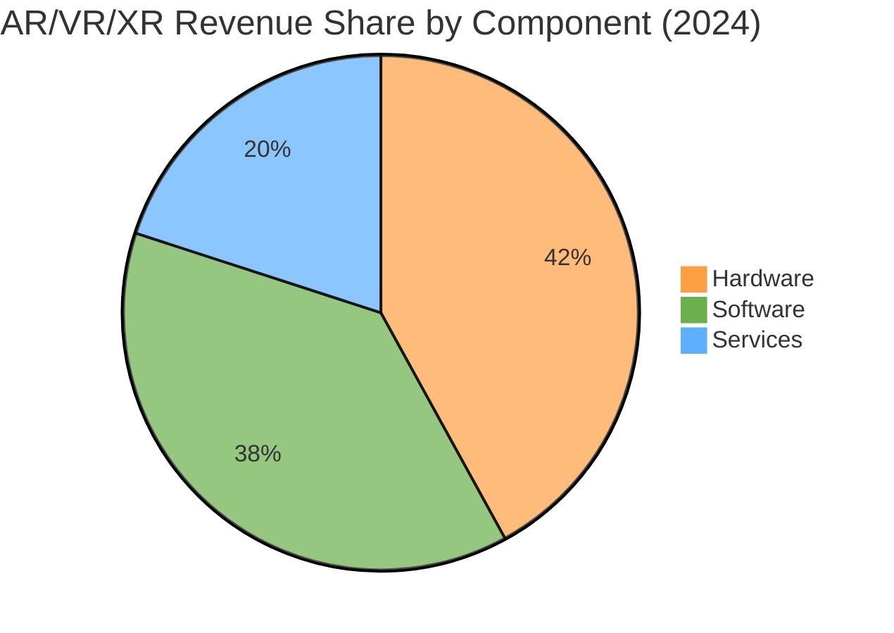
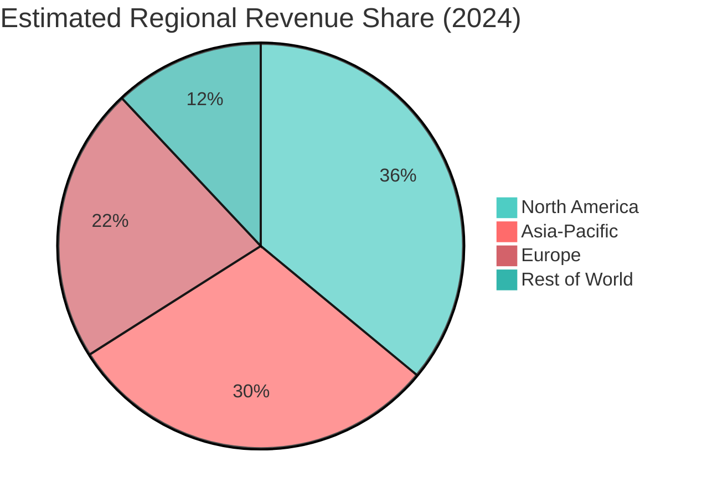

# AR/VR/XR Market – 2025 Snapshot

## Key 2025 Estimates (USD Billion)

| Segment / Source | 2025 Value | Notes |
|------------------|------------|-------|
| **AR/VR (combined) – MarketsandMarkets** | **40.62** | Base for 19.2% CAGR to 2032 (AR+VR market) |
| **AR Only – Grand View Research** | **120.21** | AR market size; CAGR 29.7% (2026‑2033) |
| **AR Only – Statista** | **198.0** | Global AR market value (2017‑2025 trend) |
| **VR/AR (XR‑like) – Mordor Intelligence** | **20.43** | VR/AR market, excludes smartphones/game consoles/metaverse platforms |
| **XR (AR+VR+MR) – Foresights Consultancy** | **39.73** | XR market estimate; CAGR 29.8% to 2034 |
| **XR (AR+VR) – Treeview Studio** | **~28.46** (2024) → **?** | 2024 base; not directly 2025 but indicates strong APAC growth |

> **Takeaway:** 2025 estimates vary widely due to differing scopes (AR only vs. AR/VR vs. XR) and what is included (e.g., whether standalone AR glasses, VR headsets, or broader spatial computing). A reasonable consolidated range for **total XR‑like revenue in 2025** is **USD 20 – 40 billion**, while the **AR‑only market** is estimated between **USD 120 – 200 billion** when including enterprise and consumer AR solutions.

## Year‑over‑Year Growth (Illustrative)

Using the mid‑point of the XR range (~30 B) and applying the commonly cited CAGR (~22‑25%):

| Year | Estimated XR Market (USD B) | Calculation |
|------|----------------------------|-------------|
| 2023 | 25.0 | Approx. from historical data |
| 2024 | 30.0 | ~20% YoY |
| 2025 | 36.0 | ~20% YoY |
| 2026 | 43.2 | ~20% YoY |
| 2030 | 108.0 | ~20% CAGR from 2025 |

*(These are illustrative; see sources for official forecasts.)*

## Revenue Breakdown by Component (2024‑2025 Approx.)

| Component | Approx. Share (2024) | Notes |
|-----------|----------------------|-------|
| Hardware | 40‑45% | HMDs, sensors, AR glasses |
| Software | 35‑40% | Platforms, development tools, enterprise apps |
| Services | 15‑20% | Consulting, integration, support, content creation |

*Hardware share is declining slightly as software and services grow faster.*

## Visualizations (Mermaid)

Below are Mermaid charts that can be rendered in Obsidian (with the Mermaid plugin enabled) or any Markdown viewer supporting Mermaid.

### Market Size Trend (2023‑2030)

```mermaid
%%{init: {'theme': 'base', 'themeVariables': { 'primaryColor': '#ff6b6b', 'secondaryColor': '#4ecdc4', 'lineColor': '#ff9f43'}}}%%
line
    title AR/VR/XR Market Size (USD Billion)
    xAxis 2023 2024 2025 2026 2027 2028 2029 2030
    "Lower Estimate" : 22 26 30 35 40 45 50 55
    "Upper Estimate" : 28 34 42 50 60 72 86 103
```

### Component Share (2024)



### Regional Split (2024 Approx.)



## Sources

1. MarketsandMarkets – *Augmented and Virtual Reality Market Report 2024‑2032*.  
   URL: https://www.marketsandmarkets.com/Market-Reports/augmented-reality-virtual-reality-market-1185.html  

2. Grand View Research – *Augmented Reality Market Size, Share | Industry Report 2033*.  
   URL: https://www.grandviewresearch.com/industry-analysis/augmented-reality-market  

3. Statista – *World Augmented Reality Market Value 2017‑2025*.  
   URL: https://www.statista.com/statistics/897587/world-augmented-reality-market-value/  

4. Mordor Intelligence – *Virtual, Augmented & Mixed Reality (VR/AR) Market Size 2031*.  
   URL: https://www.mordorintelligence.com/industry-reports/virtual-augmented-and-mixed-reality-market  

5. Foresights Consultancy – *Extended Reality (XR) Market Size, Trends Analysis Research Report 2025‑2034*.  
   URL: https://www.forinsightsconsultancy.com/extended-reality-xr-market  

6. Treeview Studio – *AR | VR | MR | XR | Metaverse | Spatial Computing Industry Statistics Report 2026*.  
   URL: https://treeview.studio/blog/ar-vr-mr-xr-metaverse-spatial-computing-industry-stats  

7. PS Market Research – *AR and VR Market Size, Trends & Growth Report, 2030*.  
   URL: https://www.psmarketresearch.com/market-analysis/augmented-reality-and-virtual-reality-market  

---
*Obsidian note: This file includes Mermaid diagrams for quick visualization. Ensure the Mermaid plugin is enabled to render charts.*