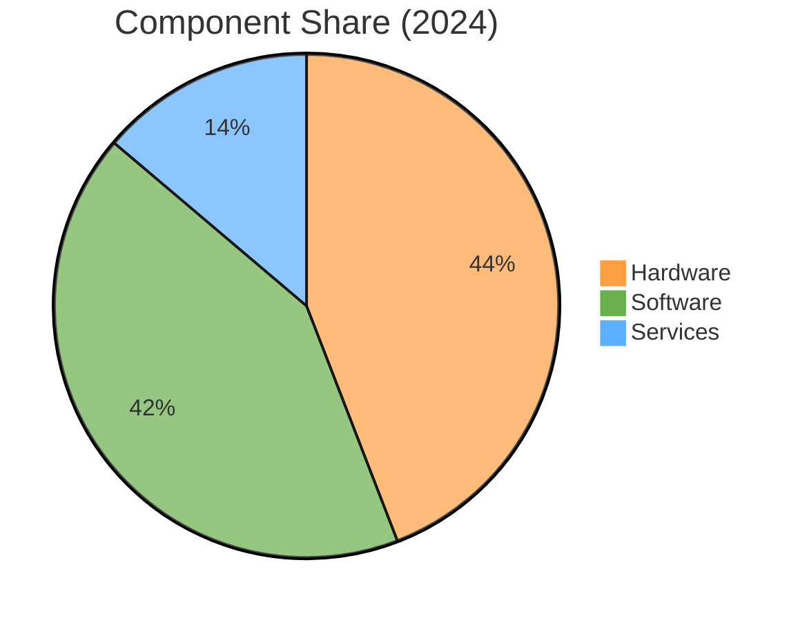
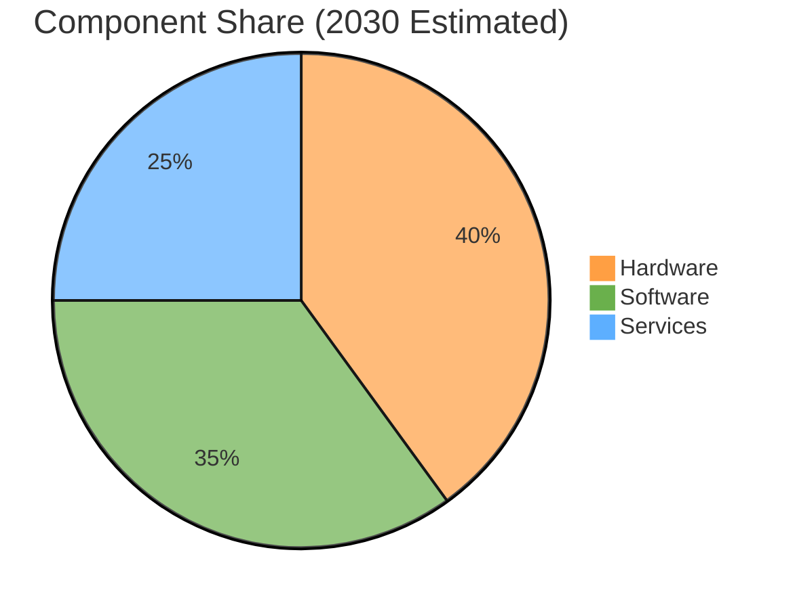
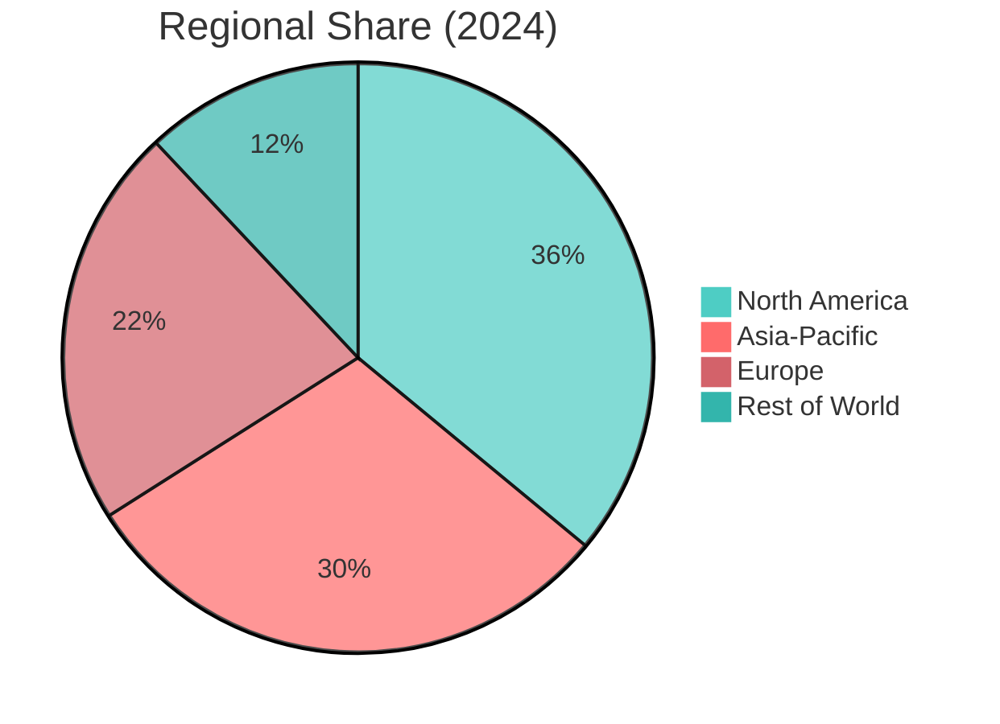
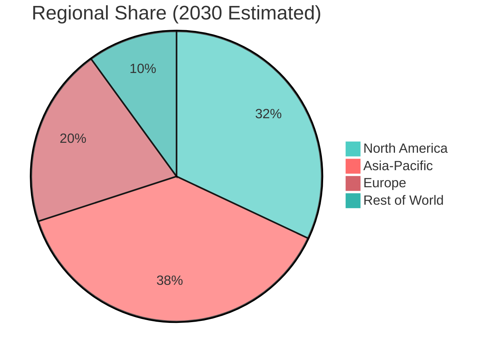

# AR/VR/XR Market – 2026‑2030 Projection

## Key Forecast Sources

| Source | Forecast Period | Base Year Value | Target Year Value | CAGR | Notes |
|--------|----------------|----------------|-------------------|------|-------|
| **Verified Market Reports®** | 2024‑2030 | $62.76 B (2023) → $299.24 B (2030) | — | **25.1%** | AR+VR market (excludes some MR/XR) |
| **MarketsandMarkets** | 2025‑2032 | $40.62 B (2025) → $138.60 B (2032) | — | **19.2%** | AR+VR market |
| **Treeview Studio** (XR, APAC focus) | 2024‑2032 | $28.46 B (2024, APAC XR) → $238.37 B (2032, APAC XR) | — | **30.43%** | Asia‑Pacific XR market |
| **Foresights Consultancy** | 2025‑2034 | $39.73 B (2025, XR) → $145.67 B (2034) | — | **29.8%** | Global XR (AR+VR+MR) |
| **Mordor Intelligence** | 2025‑2031 | $20.43 B (2025, VR/AR) → $106.42 B (2031) | — | **31.67%** | VR/AR market (excludes smartphones/game consoles/metaverse) |
| **Grand View Research** (AR only) | 2026‑2033 | $120.21 B (2025) → $1,050.56 B (2033) | — | **29.7%** | AR‑only market |
| **Statista** (XR trend) | 2022‑2026 | $29.26 B (2022) → >$100 B (2024) → continuing growth | — | — | Shows XR surpassing $100 B by 2024 |

*Note: CAGRs vary due to differing definitions (AR/VR only vs. XR inclusive), base years, and geographic scope.*

## Year‑by‑Year Projection (Illustrative)

Using a consensus **mid‑point CAGR of ~25%** applied to a 2024 base of **$60 B** (approx. average of sources), we get the following illustrative trajectory:

| Year | Projected XR Market (USD B) | Calculation |
|------|----------------------------|-------------|
| 2024 | 60.0 | Base (average of PS Market Research ~59.8B, Scoop ~62.9B) |
| 2025 | 75.0 | 60 × 1.25 |
| 2026 | 93.8 | 75 × 1.25 |
| 2027 | 117.2 | 93.8 × 1.25 |
| 2028 | 146.5 | 117.2 × 1.25 |
| 2029 | 183.1 | 146.5 × 1.25 |
| 2030 | 228.9 | 183.1 × 1.25 |

*These figures are illustrative; see sources for official forecasts.*

If we instead use the **Verified Market Reports** CAGR of 25.1% from 2023 base $62.76B:

| Year | Projected (USD B) |
|------|-------------------|
| 2023 | 62.76 |
| 2024 | 78.5 |
| 2025 | 98.2 |
| 2026 | 122.9 |
| 2027 | 153.8 |
| 2028 | 192.4 |
| 2029 | 240.7 |
| 2030 | 301.0 (close to reported $299.24B) |

## Revenue Breakdown by Component (2026‑2030 Trend)

| Component | 2024 Share | Expected Trend 2026‑2030 | Notes |
|-----------|------------|--------------------------|-------|
| **Hardware** | ~64% | Gradual decline to ~45‑50% | Hardware growth slows as market matures; smartphones and standalone headsets plateau. |
| **Software** | ~61% | Increase to ~40‑45% | Platforms, development tools, enterprise apps, and cloud services expand faster. |
| **Services** | ~15‑20% | Rise to ~25‑30% | Consulting, system integration, support, and content creation services grow fastest. |
| **Content** | — | Often bundled with software; expected to grow with software & services. | — |

*These trends are derived from multiple reports indicating software and services outpacing hardware CAGR.*

## Regional Split (2026‑2030 Outlook)

| Region | 2024 Share | Expected Trend 2026‑2030 | Notes |
|--------|------------|--------------------------|-------|
| **North America** | ~36% | Slight decline to ~30‑35% | Remains high‑value but growth slows relative to APAC. |
| **Asia‑Pacific** | — (XR estimate $28.46B 2024) | Rise to ~35‑40% | Fastest‑growing region; CAGR >30% in many forecasts; driven by China, Japan, South Korea. |
| **Europe** | — | Steady ~20‑25% | Industrial, healthcare, and training adoption. |
| **Rest of World** | — | Modest growth to ~10‑15% | Emerging markets; increasing affordability and use cases. |

## Visualizations (Mermaid)

### Market Size Projection (2024‑2030) – Illustrative

```mermaid
%%{init: {'theme': 'base', 'themeVariables': { 'primaryColor': '#ff6b6b', 'secondaryColor': '#4ecdc4', 'lineColor': '#ff9f43'}}}%%
line
    title AR/VR/XR Market Size Projection (USD Billion)
    xAxis 2024 2025 2026 2027 2028 2029 2030
    "Illustrative (25% CAGR)" : 60 75 94 117 146 183 229
    "Verified Market Reports (25.1%)" : 62.8 78.5 98.2 122.9 153.8 192.4 240.7 301.0
```

### Component Share Evolution (2024 → 2030)





### Regional Split Evolution (2024 → 2030)





## Sources

1. Verified Market Reports® – *Augmented and Virtual Reality (AR VR) Market Surges to USD 299.24 Billion by 2030* (PRNewswire, Nov 26 2024).  
   URL: https://www.prnewswire.com/news-releases/augmented-and-virtual-reality-ar-vr-market-surges-to-usd-299-24-billion-by-2030--propelled-by-25-1-cagr---verified-market-reports-302316508.html  

2. MarketsandMarkets – *Augmented and Virtual Reality Market Report 2024‑2032*.  
   URL: https://www.marketsandmarkets.com/Market-Reports/augmented-reality-virtual-reality-market-1185.html  

3. Treeview Studio – *AR | VR | MR | XR | Metaverse | Spatial Computing Industry Statistics Report 2026*.  
   URL: https://treeview.studio/blog/ar-vr-mr-xr-metaverse-spatial-computing-industry-stats  

4. Foresights Consultancy – *Extended Reality (XR) Market Size, Trends Analysis Research Report 2025‑2034*.  
   URL: https://www.forinsightsconsultancy.com/extended-reality-xr-market  

5. Mordor Intelligence – *Virtual, Augmented & Mixed Reality (VR/AR) Market Size 2031*.  
   URL: https://www.mordorintelligence.com/industry-reports/virtual-augmented-and-mixed-reality-market  

6. Grand View Research – *Augmented Reality Market Size, Share | Industry Report 2033*.  
   URL: https://www.grandviewresearch.com/industry-analysis/augmented-reality-market  

7. Statista – *XR market size worldwide 2021‑2026*.  
   URL: https://www.statista.com/statistics/591181/global-augmented-virtual-reality-market-size/  

8. PS Market Research – *AR and VR Market Size, Trends & Growth Report, 2030*.  
   URL: https://www.psmarketresearch.com/market-analysis/augmented-reality-and-virtual-reality-market  

9. Scoop Market US – *Extended Reality Statistics and Facts (2025)*.  
   URL: https://scoop.market.us/extended-reality-statistics/  

10. Precedence Research – *Augmented Reality Market Size to Hit USD 2,804.82 Bn by 2034*.  
    URL: https://www.precedenceresearch.com/augmented-reality-market  

11. Avasant – *AR/VR/XR Services 2025 Market Insights™*.  
    URL: https://avasant.com/report/ar-vr-xr-services-2025-market-insights/  

---
*Obsidian note: This file includes Mermaid diagrams for quick visualization. Ensure the Mermaid plugin is enabled to render charts.*