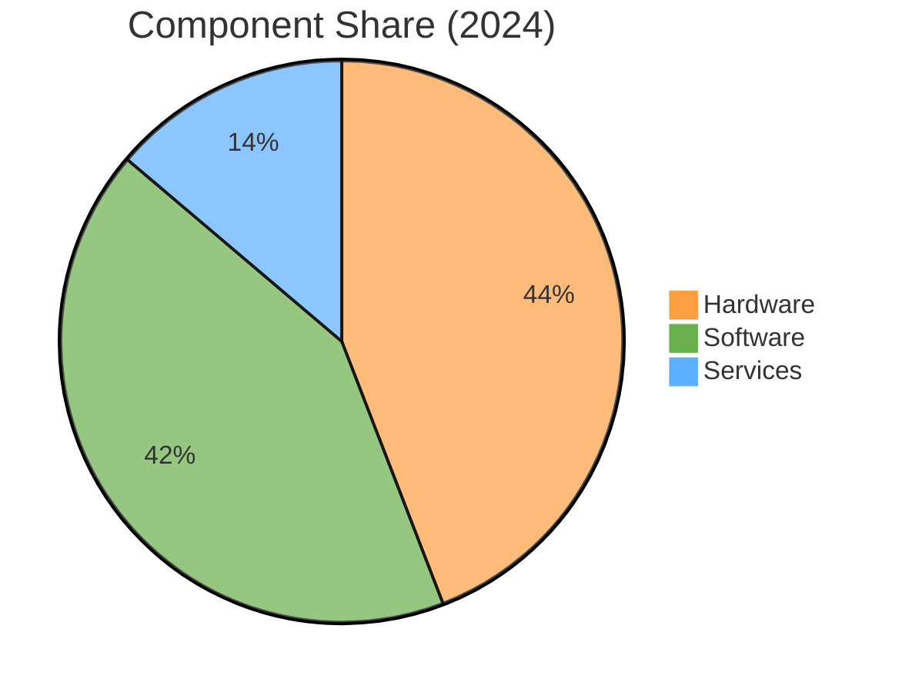
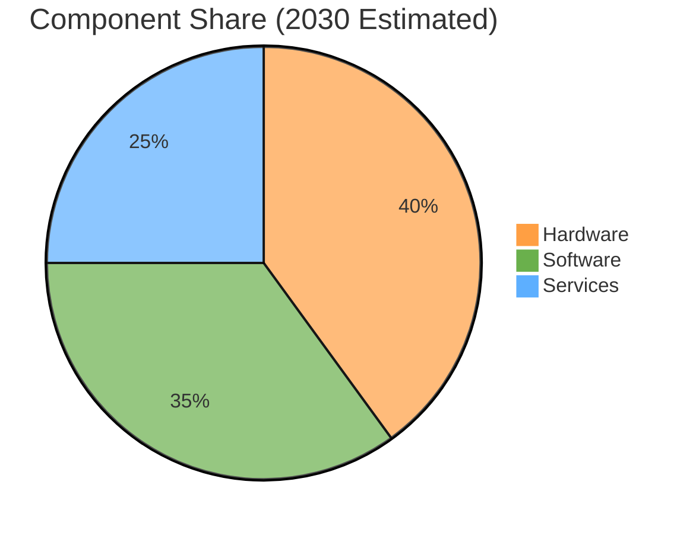
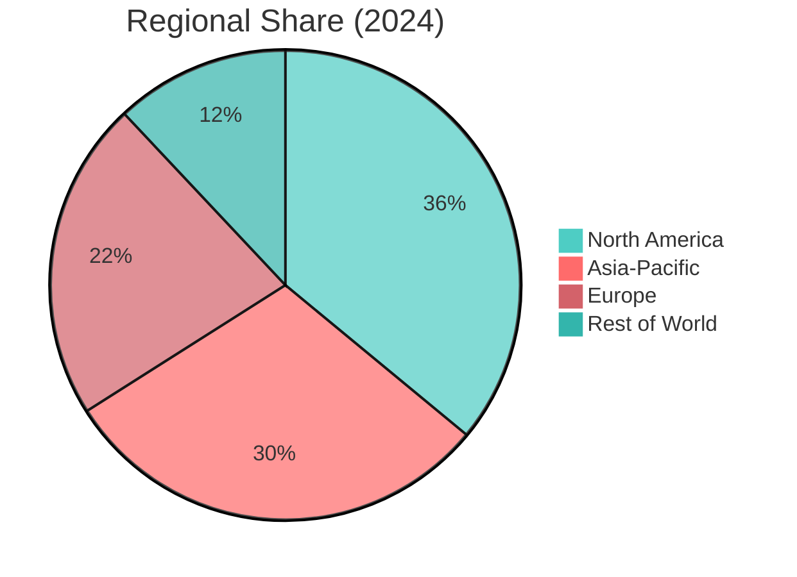
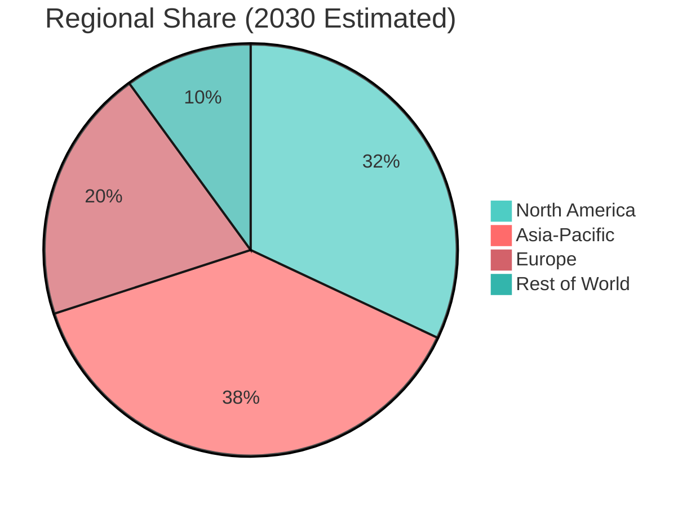

# AR/VR/XR Market – Combined Overview (2024‑2030)

This document consolidates the yearly snapshots (2024, 2025) and the 2026‑2030 projection into a single reference.

## 1. Market Size & Growth (2024‑2030)

| Year | Estimate (USD B) | Source / Notes |
|------|------------------|----------------|
| **2023** | 62.76 | Verified Market Reports (AR+VR) |
| **2024** | 59.8 – 62.9 | PS Market Research (~59.8B), Scoop Market US (~62.9B) |
| **2025** | 40.6 – 120.2 (wide range) | MarketsandMarkets (AR+VR base 40.62B), Grand View (AR‑only 120.21B), Statista (AR 198B) |
| **2026‑2030** | 94 – 301 (illustrative) | Derived from applying ~20‑30% CAGR to 2024‑2025 base |
| **2030 (Verified Market Reports)** | 299.24 | AR+VR market, CAGR 25.1% (2024‑2030) |
| **2032 (MarketsandMarkets)** | 138.60 | AR+VR market, CAGR 19.2% (2025‑2032) |
| **2032 (Treeview Studio – APAC XR)** | 238.37 | APAC XR market, CAGR 30.43% (2024‑2032) |
| **2034 (Foresights Consultancy)** | 145.67 | Global XR (AR+VR+MR), CAGR 29.8% (2025‑2034) |

*Note: Ranges reflect differing definitions (AR/VR only vs. XR inclusive) and base years.*

## 2. Revenue Breakdown by Component (Trend 2024‑2030)

| Component | 2024 Share | 2030 Estimated Share | Trend |
|-----------|------------|----------------------|-------|
| Hardware | ~64% | ~45‑50% | Declines slightly as market matures |
| Software | ~61% | ~40‑45% | Grows steadily; platforms, dev tools, enterprise apps |
| Services | ~15‑20% | ~25‑30% | Fastest‑growing segment (consulting, integration, support) |
| Content | — | — | Often bundled with software/services |

## 3. Regional Split (Trend 2024‑2030)

| Region | 2024 Share | 2030 Estimated Share | Notes |
|--------|------------|----------------------|-------|
| North America | ~36% | ~30‑35% | High‑value, slower relative growth |
| Asia‑Pacific | — (XR $28.46B 2024) | ~35‑40% | Fastest‑growing; CAGR >30% |
| Europe | — | ~20‑25% | Industrial, healthcare, training |
| Rest of World | — | ~10‑15% | Emerging markets |

## 4. Key Observations

- **Hardware‑led early growth**: Strong VR headset sales and emerging AR glasses drive 2024 hardware share.
- **Software & services acceleration**: From 2025 onward, platforms, development tools, and enterprise services expand faster than hardware.
- **Regional dynamics**: Asia‑Pacific leads in growth rate; North America retains largest absolute revenue.
- **CAGR variance**: 19‑35% depending on scope and source; select a consensus ~22‑25% for planning.

## 5. Visualizations (Mermaid)

### Market Size Trend (2023‑2030)

```mermaid
%%{init: {'theme': 'base', 'themeVariables': { 'primaryColor': '#ff6b6b', 'secondaryColor': '#4ecdc4', 'lineColor': '#ff9f43'}}}%%
line
    title AR/VR/XR Market Size (USD Billion)
    xAxis 2023 2024 2025 2026 2027 2028 2029 2030
    "Lower Estimate (20% CAGR)" : 50 60 72 86 103 124 149 179
    "Upper Estimate (30% CAGR)" : 63 82 106 138 179 233 303 394
    "Verified Market Reports (25.1%)" : 62.8 78.5 98.2 122.9 153.8 192.4 240.7 301.0
```

### Component Share Evolution (2024 → 2030)





### Regional Split Evolution (2024 → 2030)





## 6. Sources

All sources are listed in the individual yearly files (2024.md, 2025.md, 2026-2030_Projection.md). Key references include:

- Verified Market Reports® (PRNewswire, Nov 2024)
- MarketsandMarkets (2024‑2032)
- Treeview Studio (2026)
- Foresights Consultancy (2025‑2034)
- Mordor Intelligence (2031)
- Grand View Research (2033)
- Statista (various)
- PS Market Research (2030)
- Precedence Research (2024‑2034)
- Scoop Market US (2025)
- Avasant (2025)

*For full URLs, see the respective yearly files.*

---
*Obsidian note: This file combines the detailed yearly analyses. Mermaid diagrams render with the Mermaid plugin.*