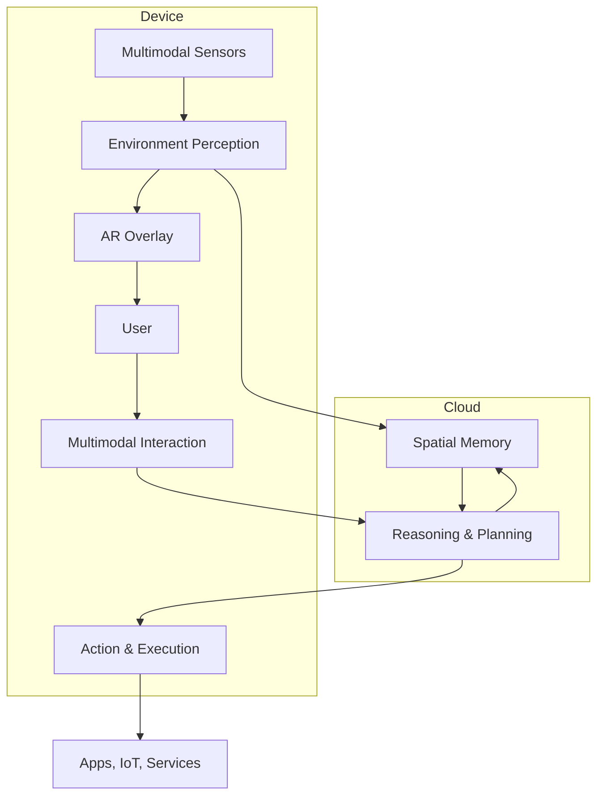

# High-Level Architecture for a Spatial AI Assistant

## Overview

Spatial AI assistants integrate perception, reasoning, interaction, and display to provide context-aware, proactive aid in physical spaces.

This rough draft maps major needed components, typical interconnections, and considers on-device vs. cloud deployment trade-offs.

---

## Core Components

### 1. Environment Perception Layer
- Scene Understanding & Object Recognition
- Inputs: Multimodal sensors including RGB-D cameras, depth sensors, lidar, inertial measurement units (IMU)
- Outputs: Semantic 3D map with object annotations, spatial landmarks, surface topology
- On-device processing for low-latency mapping and interaction; occasional cloud uploads for model updates or heavyweight processing

### 2. Spatial Memory & Context Management
- Persistent spatial memory of user environment and interactions
- Context fusion across sessions and devices (headset/phone/cloud)
- Privacy-aware storage and retrieval
- Mostly cloud-backed with on-device cache for fast access and offline resilience

### 3. Multimodal Interaction Module
- Natural language understanding and generation (speech, text)
- Gaze estimation, gesture recognition, and hand tracking
- Contextual disambiguation using spatial context
- Primarily on-device for responsiveness; cloud assist for complex language reasoning or personalization

### 4. Reasoning & Planning Engine
- Large Language Model (LLM) integrated with spatial and temporal reasoning modules
- Goal decomposition, multi-step task planning and adaptive behavior
- Runs mostly in cloud due to compute intensity but with latency-aware caching or distilled models on-device

### 5. Action & Execution Layer
- Cross-application command execution (mobile apps, IoT, AR content)
- Intelligent agentic behavior, including querying external knowledge bases
- Runs on-device for direct control; cloud for complex coordination and orchestration

### 6. AR Overlay & Information Projection
- Context-aware augmentation of visual input
- Dynamic UI composition based on task and environment
- Strictly on-device for real-time feedback and low latency

### 7. System & Security Framework
- Authentication, privacy controls, data encryption
- User trust and transparency layers
- Hybrid between device and cloud

---

## Component Interaction



## On-Device vs. Cloud

| Component                 | On-Device                    | Cloud                                      |
|---------------------------|-----------------------------|--------------------------------------------|
| Environment Perception    | Real-time mapping and tracking | Model training, heavy inference, updates   |
| Spatial Memory & Context  | Cached access, local storage  | Persistent storage, cross-device sync      |
| Multimodal Interaction   | Initial interpretation, low-latency response | Complex reasoning, user personalization   |
| Reasoning & Planning     | Lightweight inference cache   | Large LLMs, complex planning, adaptive learning|
| Action & Execution       | Local commands, direct control | Orchestration, cloud-service integration    |
| AR Overlay & Projection  | Real-time visual rendering     | N/A                                         |
| Security & Privacy        | Device identity, encryption   | Central auth, data governance               |

---

## Summary

Building a spatial AI assistant is a multi-disciplinary problem requiring edge/cloud cooperation.

This architecture prioritizes seamless integration of perception, reasoning, action, and natural interaction while preserving latency and privacy.

---

## OBSIDIAN_MD

```md
---
title: High-Level Architecture for a Spatial AI Assistant
type: report
topic: ar-vr
date: 2026-04-21
created: 2026-04-21
updated: 2026-04-21
source: synthesis of recent research areas
tags: [ar-vr, report, spatial-ai, architecture]
status: draft
summary: Rough draft architecture outlining components, connections, and deployment for a Spatial AI Assistant based on competitive landscape and core enabling technologies.
---

# High-Level Architecture for a Spatial AI Assistant

## Overview

Spatial AI assistants integrate perception, reasoning, interaction, and display to provide context-aware, proactive aid in physical spaces.

This rough draft maps major needed components, typical interconnections, and considers on-device vs. cloud deployment trade-offs.

## Core Components

### 1. Environment Perception Layer
- Scene Understanding & Object Recognition
- Inputs: Multimodal sensors including RGB-D cameras, depth sensors, lidar, inertial measurement units (IMU)
- Outputs: Semantic 3D map with object annotations, spatial landmarks, surface topology
- On-device processing for low-latency mapping and interaction; occasional cloud uploads for model updates or heavyweight processing

### 2. Spatial Memory & Context Management
- Persistent spatial memory of user environment and interactions
- Context fusion across sessions and devices (headset/phone/cloud)
- Privacy-aware storage and retrieval
- Mostly cloud-backed with on-device cache for fast access and offline resilience

### 3. Multimodal Interaction Module
- Natural language understanding and generation (speech, text)
- Gaze estimation, gesture recognition, and hand tracking
- Contextual disambiguation using spatial context
- Primarily on-device for responsiveness; cloud assist for complex language reasoning or personalization

### 4. Reasoning & Planning Engine
- Large Language Model (LLM) integrated with spatial and temporal reasoning modules
- Goal decomposition, multi-step task planning and adaptive behavior
- Runs mostly in cloud due to compute intensity but with latency-aware caching or distilled models on-device

### 5. Action & Execution Layer
- Cross-application command execution (mobile apps, IoT, AR content)
- Intelligent agentic behavior, including querying external knowledge bases
- Runs on-device for direct control; cloud for complex coordination and orchestration

### 6. AR Overlay & Information Projection
- Context-aware augmentation of visual input
- Dynamic UI composition based on task and environment
- Strictly on-device for real-time feedback and low latency

### 7. System & Security Framework
- Authentication, privacy controls, data encryption
- User trust and transparency layers
- Hybrid between device and cloud

## Component Interaction


## On-Device vs. Cloud

| Component                 | On-Device                    | Cloud                                      |
|---------------------------|-----------------------------|--------------------------------------------|
| Environment Perception    | Real-time mapping and tracking | Model training, heavy inference, updates   |
| Spatial Memory & Context  | Cached access, local storage  | Persistent storage, cross-device sync      |
| Multimodal Interaction   | Initial interpretation, low-latency response | Complex reasoning, user personalization   |
| Reasoning & Planning     | Lightweight inference cache   | Large LLMs, complex planning, adaptive learning|
| Action & Execution       | Local commands, direct control | Orchestration, cloud-service integration    |
| AR Overlay & Projection  | Real-time visual rendering     | N/A                                         |
| Security & Privacy        | Device identity, encryption   | Central auth, data governance               |

## Summary

Building a spatial AI assistant is a multi-disciplinary problem requiring edge/cloud cooperation.

This architecture prioritizes seamless integration of perception, reasoning, action, and natural interaction while preserving latency and privacy.

