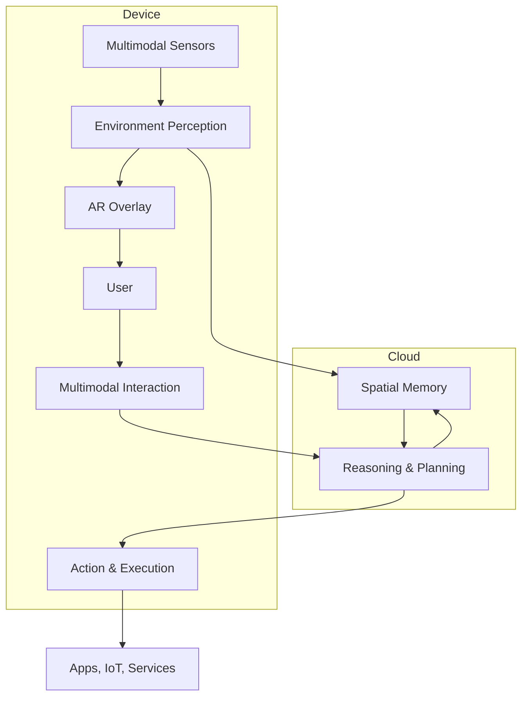

# Spatial AI Assistant Architecture

**Summary**: Detailed 7-layer architecture for building a Spatial AI Assistant, with component descriptions, interaction flows, and on-device vs. cloud deployment strategy.

**Sources**: `Spatial_AI_Assistant_High-Level_Architecture_2026-04-21.md`, `Spatial_AI_Assistant_Report_2.1.docx.pdf`, `Spatial AI Assistant – High-Level Architecture.pdf`, `2_3b_voice_interaction_spatial_context.pdf`

**Last updated**: 2026-04-24

---

## Architecture Diagram



---

## 7 Core Components

### 1. Environment Perception Layer

**Purpose**: Perceive and understand the physical environment in real time.

**Inputs**:
- RGB-D cameras
- Depth sensors
- Lidar
- IMU (accelerometer, gyroscope)

**Outputs**:
- Semantic 3D map with object annotations
- Spatial landmarks
- Surface topology

**Deployment**: On-device for low-latency mapping; occasional cloud uploads for model updates.

**Technology references**:
- [[arkit-scene-understanding]] — Apple ARKit
- [[meta-scene-api]] — Meta Scene API
- [[google-scene-semantics]] — Google Scene Semantics
- [[open-source-scene-understanding]] — SAM, GroundingDINO
- [[slam]] — core SLAM technology

---

### 2. Spatial Memory & Context Management

**Purpose**: Remember spatial context across sessions and devices.

**Functions**:
- Persistent spatial memory of user environment
- Context fusion across sessions
- Cross-device sync (headset/phone/cloud)
- Privacy-aware storage and retrieval

**Deployment**: Mostly cloud-backed with on-device cache for fast access and offline resilience.

**Strategic note**: This is the **primary gap** in all current competitors. No existing product delivers persistent spatial memory.

---

### 3. Multimodal Interaction Module

**Purpose**: Natural human-computer interaction through multiple modalities.

**Capabilities**:
- Natural language understanding (NLU)
- Speech recognition and generation
- Gaze estimation
- Gesture recognition
- Hand tracking
- Contextual disambiguation using spatial context

**Deployment**: Primarily on-device for responsiveness; cloud assist for complex language reasoning.

**Related pages**: [[xr-hardware]] — input devices

---

### 4. Reasoning & Planning Engine

**Purpose**: Higher-order cognition for spatial understanding and task execution.

**Capabilities**:
- Large Language Model (LLM) integration
- Spatial reasoning ("the red folder is on the left shelf")
- Temporal reasoning (sequences, schedules, routines)
- Goal decomposition
- Multi-step task planning
- Adaptive behavior based on learn patterns

**Deployment**: Mostly cloud due to compute intensity; distilled models cached on-device for low-latency tasks.

---

### 5. Action & Execution Layer

**Purpose**: Execute tasks and commands in the physical and digital world.

**Capabilities**:
- Cross-application command execution
- IoT device control
- AR content management
- External knowledge base queries
- Intelligent agentic behavior

**Deployment**: On-device for direct control; cloud for complex orchestration.

---

### 6. AR Overlay & Information Projection

**Purpose**: Present information and augmentation to the user.

**Capabilities**:
- Context-aware visual augmentation
- Dynamic UI composition
- Spatial labels and annotations
- Information highlighting

**Deployment**: Strictly on-device for real-time feedback and low latency.

**Related pages**: [[xr-hardware]] — display technologies

---

### 7. System & Security Framework

**Purpose**: Identity, privacy, and trust infrastructure.

**Capabilities**:
- Authentication (biometric, PIN, wearable proximity)
- Privacy controls (data sharing permissions)
- Encryption (at rest and in transit)
- User trust and transparency layers
- Audit logging

**Deployment**: Hybrid between device and cloud.

## Real-Time "ctOS" Interface (The Profiler HUD)

To achieve the "ctOS" (Watch Dogs) effect—where employee metadata, interaction history, and meeting notes appear as real-time overlays—the architecture must prioritize **High-Frequency Contextual Retrieval**.

### 1. The Profiling Pipeline
Unlike standard RAG, which is user-triggered, the "ctOS" interface is **proactive** and requires a dedicated streaming pipeline:

*   **Identity Anchoring**: Uses [[ego-centric-3d-perception]] to detect human forms, combined with Bluetooth/UWB proximity signals from corporate badges or phones to "soft-identify" individuals before visual confirmation.
*   **Semantic Proximity Trigger**: When a person enters the user's "focal cone" (inner 30 degrees of vision), the system triggers a **Contextual Fetch** from the [[spatial-ai-assistant]] backend.
*   **Data Synthesis**: An on-device LLM (e.g., a quantized Llama 3 or Gemini Nano) synthesizes the last 3 Slack messages, the most recent email thread, and upcoming calendar invites into a 3-bullet "Briefing."

### 2. "The Ghost Layer" Implementation
Because current hardware varies, the HUD is deployed in tiers:

| Tier | Hardware | Interaction Mode | Latency Goal |
| :--- | :--- | :--- | :--- |
| **Audio Ghost** | Meta Ray-Ban AI | Low-latency "Whisper" cues in ear; audio-only profiling. | <200ms (Trigger to Voice) |
| **Visual Ghost** | Samsung Galaxy XR / AVP | 3D-pinned HUD text floating above the person's head. | <50ms (Pose Update) |
| **Full ctOS** | Next-gen AR Glasses | Interactive metadata; "hacking" (interacting) with smart office IoT. | <10ms (Visual Stability) |

### 3. Critical Dependencies
*   **Persistent Spatial Memory**: Requires [[splatam]] to ensure the HUD stays "stuck" to a person even if they turn their head or walk behind a pillar.
*   **Privacy-First "Masking"**: To comply with office privacy, the system must use "Semantic Blur" for non-consenting co-workers, only showing info for opted-in team members.

---

## On-Device vs. Cloud Deployment

| Component | On-Device | Cloud |
|-----------|-----------|-------|
| Environment Perception | Real-time mapping, tracking | Model training, heavy inference, updates |
| Spatial Memory | Cached access, local storage | Persistent storage, cross-device sync |
| Multimodal Interaction | Initial interpretation, low-latency response | Complex reasoning, user personalization |
| Reasoning | Lightweight inference cache | Large LLMs, complex planning |
| Action | Local commands, direct control | Orchestration, cloud-service integration |
| AR Overlay | Real-time visual rendering | N/A |
| Security | Device identity, encryption | Central auth, data governance |

---

## Data Flow

1. **Input**: Sensors capture multimodal data (camera, mic, IMU)
2. **Perception**: On-device processing extracts spatial features and semantic labels
3. **Memory**: Spatial context retrieved from persistent storage
4. **Reasoning**: Cloud LLM processes request with spatial context
5. **Action**: Execution commands generated
6. **Output**: AR overlay renders real-time response

---

## Build Considerations

### For Imagination AI (Platform Layer)

- Focus on layers 2 (Spatial Memory) and 4 (Reasoning) as core IP
- Build device SDKs for perception integration
- Own the memory persistence standard

### For 9D Technologies (Training Application)

- Use existing spatial perception (Meta Scene API, ARKit)
- Focus on layers 4 (Reasoning) and 5 (Action) for adaptive training
- Build proprietary training scenarios on top of architecture

### Initial Platform Recommendation

| Use Case | Platform | Perceive | Memory | Reason |
|---------|---------|---------|---------|--------|
| Prototype | Quest 3 + Unity | Meta Scene API | Convai/Inworld | GPT-4o API |
| Enterprise | Vision Pro | ARKit | Custom | GPT-4o API |
| Consumer | Android XR | ARCore | Custom | Gemini |

---

## Scene Graph Architecture

A key concept from the companion architecture document (`Spatial AI Assistant – High-Level Architecture.pdf`): the **scene graph** is the persistent world model that connects perception output to reasoning input.

```
Physical Objects
    ↓ (detected by perception layer)
Scene Graph
  ├── Nodes = objects (coffee mug, desk, laptop, door)
  └── Edges = spatial relationships (on, near, left-of, occluded-by)
    ↓ (queried by reasoning layer)
LLM receives structured context: "coffee mug is on desk, left of laptop"
```

The scene graph enables:
- Persistent anchors (object positions remembered across sessions)
- Cross-session world memory (the spatial state that all current LLMs lack — see [[llm-spatial-reasoning]])
- Semantic relationships (not just where things are, but how they relate)
- Incremental updates (add new observations without re-mapping from scratch)

**The 4 identified gaps in current scene graph implementations** (source: `Spatial AI Assistant – High-Level Architecture.pdf`):
1. No unified scene graph standard across platforms
2. Weak real-time semantic understanding (slow object labeling)
3. Poor long-term memory (no cross-session persistence in commercial products)
4. Limited spatial reasoning over space (see [[llm-spatial-reasoning]] for benchmark data)

---

## Latency Requirements

**<100ms** total response time is required for XR comfort — from user input to visual/audio output. (Source: `Spatial AI Assistant – High-Level Architecture.pdf`)

This breaks down across the pipeline:
- On-device perception + feature extraction: ~10-20ms
- Scene graph query: ~5-10ms
- LLM inference (cloud): ~50-70ms
- Response rendering (AR overlay or voice): ~10-20ms

Voice pipeline has an additional constraint: **<600ms** from utterance to first audio token (see [[voice-interaction-spatial]]). These are compatible requirements: 100ms applies to AR overlay rendering; 600ms applies to the full voice round-trip.

**On-device vs. cloud split** (from source PDF):

| Component | On-Device | Cloud |
|-----------|-----------|-------|
| Tracking + SLAM | ✓ Real-time localization | Model updates |
| YOLO-lite object detection | ✓ Fast inference | — |
| Rendering + AR overlay | ✓ Low latency required | — |
| Large language models | Cached/distilled only | ✓ Primary inference |
| SAM (Segment Anything) | — | ✓ Heavy inference |
| GroundingDINO | — | ✓ Heavy inference |
| Scene graph persistence | Local cache | ✓ Cross-session storage |

---

## Related pages

- [[spatial-ai-assistant]]
- [[llm-spatial-reasoning]]
- [[voice-interaction-spatial]]
- [[slam]]
- [[arkit-scene-understanding]]
- [[meta-scene-api]]
- [[google-scene-semantics]]
- [[open-source-scene-understanding]]
- [[genai-animation]]
- [[xr-hardware]]
- [[xr-platforms]]