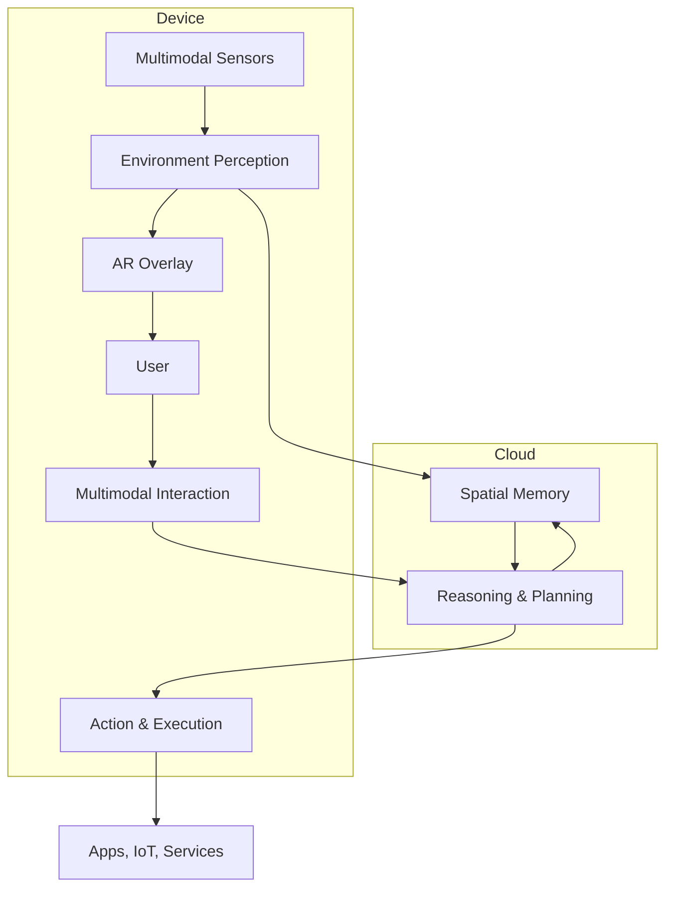

# Spatial AI Assistant

**Summary**: Defines the Spatial AI Assistant concept, maps the confirmed whitespace no existing product fills, and frames the strategic opportunity for Imagination AI and 9D Technologies.

**Sources**: `Spatial_AI_Assistant_Report_2.1.docx.pdf`, `Competitive Landscape for Spatial AI Assistants.pdf`, `XR_Competitive_Landscape_Major_Players.md`, `Major players across Hardware, Softwares and AI.pdf`, `Spatial_AI_Assistants_Landscape_2026-04-21.md`, `Spatial_AI_Assistant_High-Level_Architecture_2026-04-21.md`

**Last updated**: 2026-04-21

---

## Definition

A Spatial AI Assistant combines four capabilities:

1. **Computer Vision** — perceives the physical environment in real time
2. **Context Awareness** — understands who the user is, where they are, and what they are doing
3. **Natural Interaction** — responds to voice, gesture, gaze, and spatial intent
4. **Real-Time Assistance** — delivers actionable help without requiring explicit commands

This is distinct from a voice assistant (which lacks spatial grounding) and from a navigation app (which lacks reasoning and interaction).

## The Confirmed Whitespace

Four independent sources converge on the same finding: **no current product delivers the full combination of persistent spatial memory, proactive intelligence, and real-world actionability in a spatial computing context**.

The five specific gaps identified (source: `Competitive Landscape for Spatial AI Assistants.pdf`):

| Gap | Description |
|-----|-------------|
| **Persistent spatial memory** | No product remembers spatial context across sessions (where objects are, what the user has done in a space) |
| **Spatial reasoning** | No product reasons about physical relationships between objects and people in a space |
| **Fragmented multimodal interaction** | Voice, gesture, and gaze exist but are not unified into coherent spatial interaction |
| **No real-world actionability** | Assistants can answer questions but cannot take actions in the physical world via spatial context |
| **No ambient intelligence** | No product monitors the environment continuously and acts proactively without being prompted |

This convergence — confirmed by market reports, competitive analyses, and technology assessments — validates the thesis behind both Imagination AI and 9D Technologies.

## Current Competitors and Their Limits

| Player | What They Offer | What They Lack |
|--------|-----------------|----------------|
| **Meta AI (Quest)** | Voice-activated AI assistant in headset; Ray-Ban smart glasses with camera | No persistent spatial memory; reactive not proactive; closed to third-party spatial data |
| **Apple Intelligence (Vision Pro)** | Siri + on-device ML + visionOS spatial awareness | Spatial memory not persistent across sessions; limited actionability; no ambient mode |
| **Google Gemini (Android XR)** | Multimodal AI with vision; strong NLP and spatial cues | Not yet shipping on spatial hardware at scale; no persistent spatial memory layer |
| **Microsoft Copilot (post-Mesh)** | HoloLens 2 + Azure AI integration; retiring Mesh (Dec 2025) | Mesh retirement leaves enterprise collaboration gap; no general consumer spatial AI |
| **OpenAI (no hardware)** | GPT-4o with vision; strong multimodal understanding | No spatial computing hardware; no persistent memory; no real-time spatial grounding |
| **Snap Spectacles** | AR glasses with real-time spatial overlays | Limited AI integration; niche developer focus; no persistent memory |

(Sources: `Spatial_AI_Assistant_Report_2.1.docx.pdf`, `XR_Competitive_Landscape_Major_Players.md`)

## Updated 2026 Landscape

The April 2026 landscape shows accelerated productization across multiple players (source: `Spatial_AI_Assistants_Landscape_2026-04-21.md`):

| Player | Product | Core Capability | Key Limitation |
|--------|---------|------------------|----------------|
| **Google** | Lens + Gemini Glasses (expected 2026) | Visual recognition + AI assistant in lightweight specs | Launch pending; ecosystem unknown |
| **Apple** | Vision Pro + Intelligence | Robust spatial interface + tight hardware integration | High cost ($3,499); not ambient |
| **Meta** | Ray-Ban AI Glasses | Persistent always-available voice AI in wearable | Discrete display; limited output modalities |
| **Rabbit** | R1 | Cross-app voice agent with LAM OS | Mixed reliability reviews |
| **Humane** | AI Pin | Wearable ambient AI with projected display | Poor execution; user acceptance issues |
| **AskUI** | Software agent | AI-driven UI control and automation | Desktop/web only; no spatial embodiment |

### New Gaps Identified

The 2026 source confirms the original whitespace and adds:

- **Lightweight wearables vs bulky headsets** — fundamental tradeoff between form factor and power
- **Privacy, trust, and social norms** — challenges constant spatial AI presence in daily life
- **Output modality limitations** — lightweight wearables cannot match spatial display capabilities

## Technical Architecture of a Spatial AI Assistant

Based on `Spatial_AI_Assistant_High-Level_Architecture_2026-04-21.md`, the architecture consists of 7 core components with explicit on-device vs. cloud deployment split.

### Architecture Overview

### 7 Core Components

| Layer | Function | On-Device | Cloud |
|-------|----------|-----------|-------|
| **1. Environment Perception** | Scene understanding, object recognition, 3D mapping | Real-time mapping, tracking | Model training, heavy inference |
| **2. Spatial Memory** | Persistent context across sessions/devices | Cache, fast access | Persistent storage, cross-device sync |
| **3. Multimodal Interaction** | NLU, gaze, gesture, hand tracking | Initial interpretation | Complex reasoning, personalization |
| **4. Reasoning & Planning** | LLM + spatial/temporal reasoning | Lightweight cache | Large LLMs, complex planning |
| **5. Action & Execution** | Cross-app commands, IoT control | Local commands | Orchestration, coordination |
| **6. AR Overlay** | Real-time visual augmentation | Real-time rendering | N/A |
| **7. Security/Privacy** | Auth, encryption, trust | Device identity | Central auth, governance |

### Key Architectural Insights

1. **Perception runs on-device** for low-latency spatial mapping
2. **Memory layer bridges device and cloud** — the primary gap identified in competitors
3. **Reasoning runs mostly cloud** due to LLM compute requirements
4. **AR overlay is strictly on-device** for real-time feedback
5. **This architecture prioritizes** seamless integration while preserving latency and privacy

For full component details, see [[spatial-ai-assistant-architecture]].

## Implications for Imagination AI

Imagination AI's opportunity is at the **platform layer**: build the persistent spatial memory and reasoning infrastructure that currently does not exist. This positions the company to be the intelligence layer that sits above any spatial OS (visionOS, Horizon OS, Android XR) — analogous to how Stripe sits above any payment rail.

Key moves:
- Own the spatial memory standard before any of the big three lock it down
- Partner with enterprise-first hardware (HoloLens successors, Magic Leap 2) while consumer scale catches up
- Build developer APIs that make the spatial memory layer accessible to third-party applications

## Implications for 9D Technologies

9D Technologies can use the validated evidence base (see [[vr-healthcare-evidence]], [[xr-simulations-training]]) to position a Spatial AI Assistant as the intelligence layer on top of XR training simulations.

Key moves:
- Lead with healthcare and enterprise training where ROI is proven (52% cost savings, 60-75% time reduction per [[xr-simulations-training]])
- Use the 45-RCT meta-analysis (Sung et al. 2024) and other academic evidence in enterprise sales materials
- Position as the proactive training assistant that adapts in real time based on learner spatial behavior — a capability no current LMS or XR training platform offers

### Strategic Direction Update (May 2026)

At the May 05 leadership debrief with Moiz, 9D's strategy was formally realigned toward **B2B enterprise** with a **data moat thesis**. The product must target a vertical where exclusive proprietary task/scene data can be accumulated through no-cost enterprise pilots. Candidate verticals: industrial training, data center ops, labs, construction. B2C approaches (including calorie tracking POC) are paused.

See [[monthly-brief-2026-05-05]] for the full decision record.

## Related pages

- [[competitive-landscape]]
- [[xr-platforms]]
- [[xr-hardware]]
- [[slam]]
- [[vr-healthcare-evidence]]
- [[xr-simulations-training]]
- [[xr-productivity]]
- [[google-gemini-smart-glasses]]
- [[meta-rayban-ai-glasses]]
- [[spatial-ai-assistant-architecture]]
